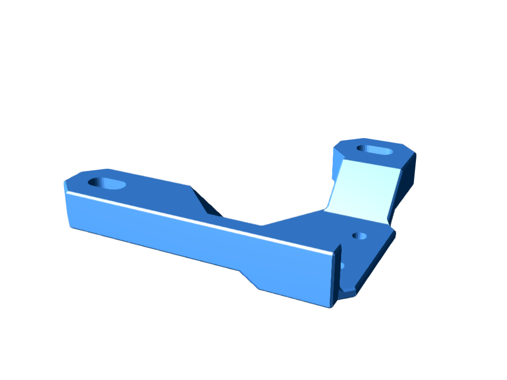
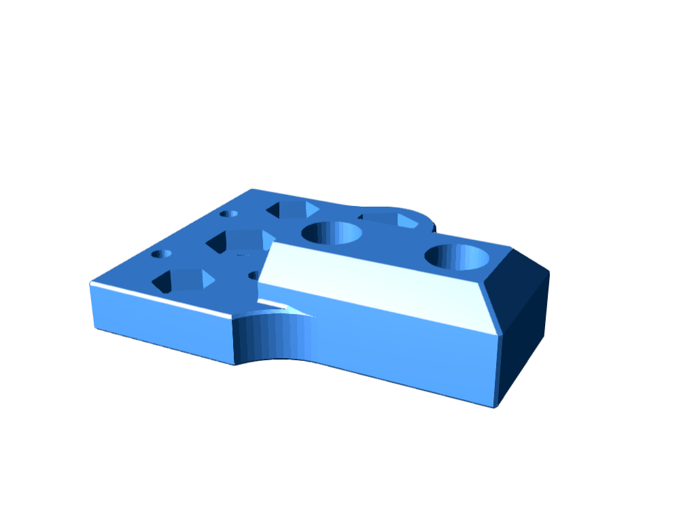
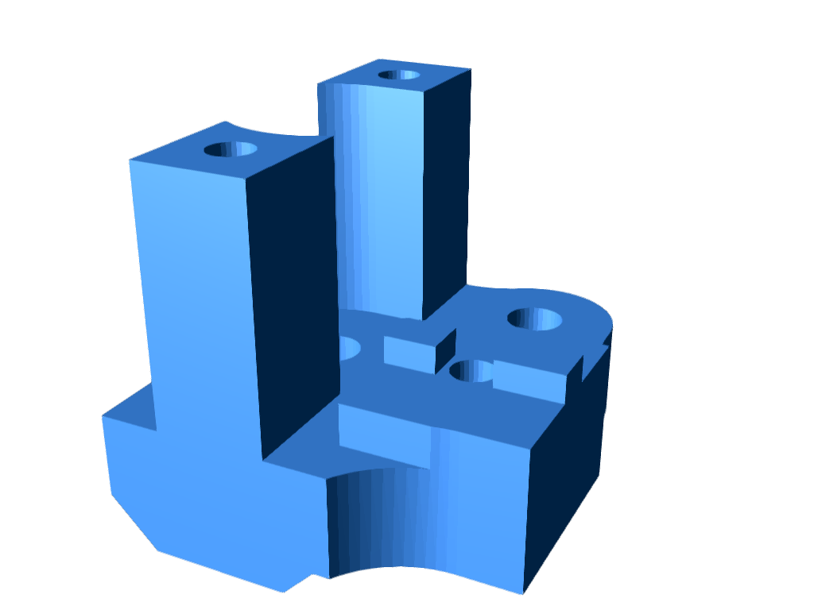
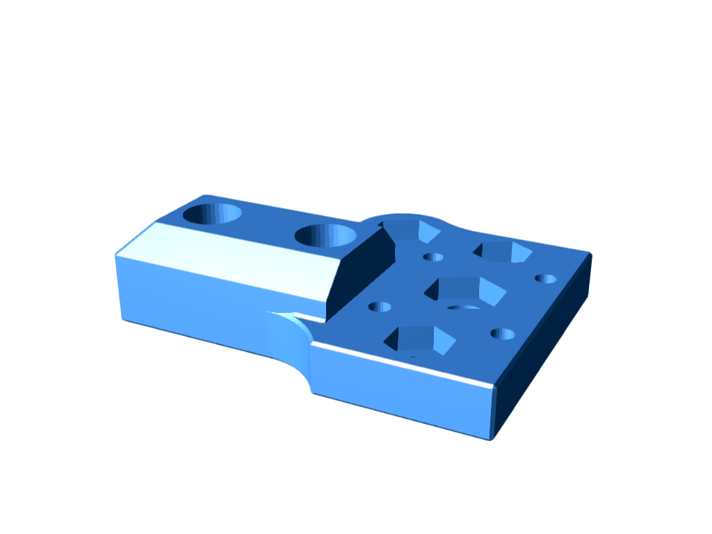
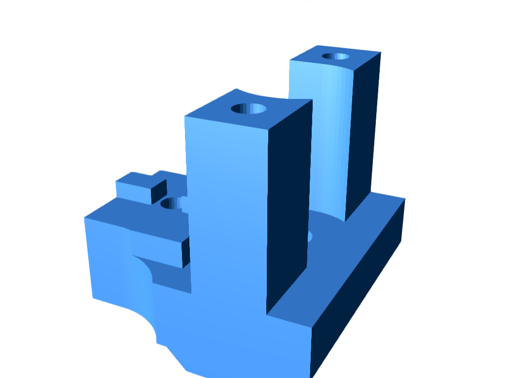
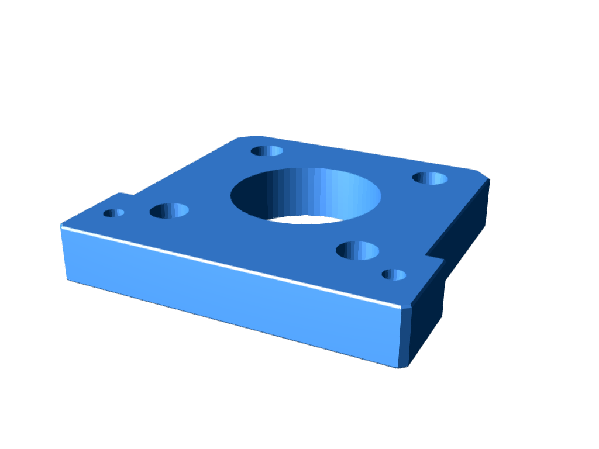
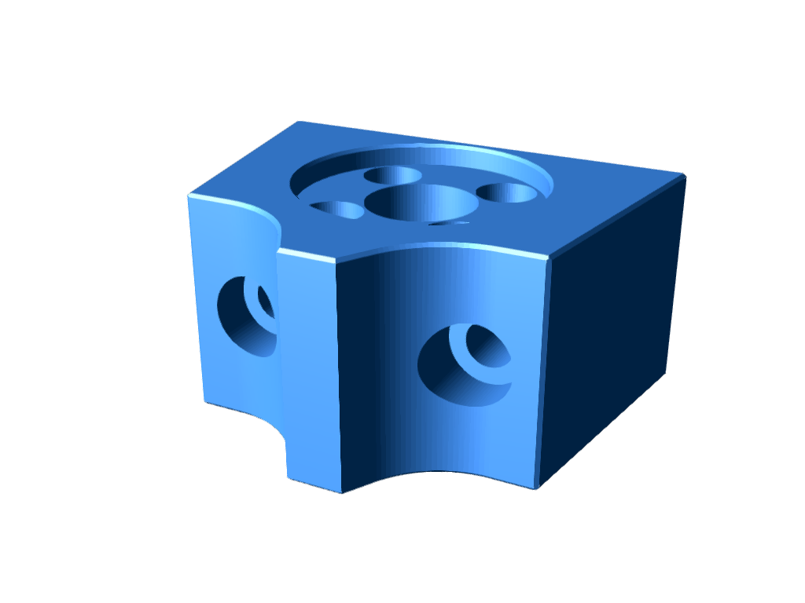
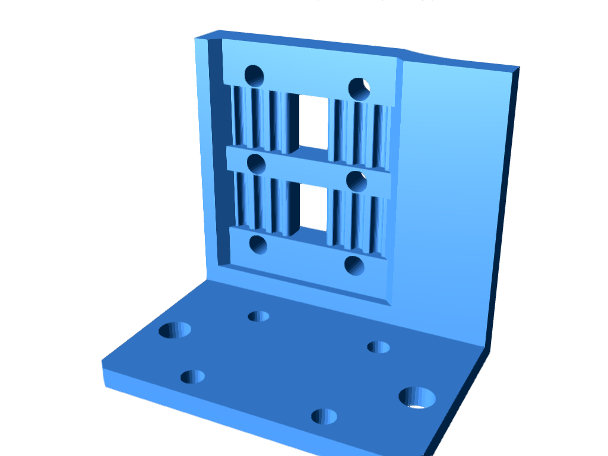
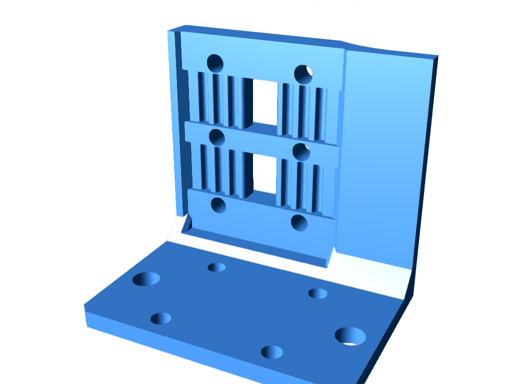

# Old Version Archive

This directory contains previous versions of STL files that have been updated or renamed.
Each section describes what changed from this version to the current version.

[日本語](README.md)

---

## Holder_X_Limit_Switch

Fixed switch mounting hole size.

| File | Image |
|---|---|
| [Holder_X_Limit_Switch_KP3S_v2.stl](Holder_X_Limit_Switch_KP3S_v2.stl) |  |

---

## Bracket_XY

Renamed from `L1`/`L2`/`R1`/`R2` to `LB`/`LU`/`RB`/`RU` (B = Bottom, U = Upper).

| File | Image |
|---|---|
| [Bracket_XY_L1_r.stl](Bracket_XY_L1_r.stl) |  |
| [Bracket_XY_L2_r.stl](Bracket_XY_L2_r.stl) |  |
| [Bracket_XY_R1_r.stl](Bracket_XY_R1_r.stl) |  |
| [Bracket_XY_R2_r.stl](Bracket_XY_R2_r.stl) |  |

---

## Holder_Z_Motor

Added rear panel mounting holes.

| File | Image |
|---|---|
| [Holder_Z_Motor_v3.stl](Holder_Z_Motor_v3.stl) |  |

---

## Holder_Z_Nut_1k

Removed Z-axis limit switch hole.

| File | Image |
|---|---|
| [Holder_Z_Nut_1k_r.stl](Holder_Z_Nut_1k_r.stl) |  |

---

## Holder_Head-belt

Changed extruder motor mounting position.

| File | Image |
|---|---|
| [Holder_Head-belt_r.stl](Holder_Head-belt_r.stl) |  |
| [Holder_Head-belt_v2_r.stl](Holder_Head-belt_v2_r.stl) |  |

---
